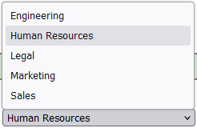

# Simple Dropdown Library

A simple and lightweight library for creating dropdown menus in web applications.

## Installation

You can install the library using npm:

```bash
npm install simple-dropdown-library
```

Or add it to your package.json

## Import

You can import the library where you need it with :

```
import SimpleDropdown from 'simple-dropdown-library';
```

## Usage

And then use it like this :

```
<SimpleDropdown
    option1={{value1}}
    option2={{value2}}
    option3={{value=3}}
/>
```

## Options

You must set three options : 
 - listeAttributsSelect => Json object than contains all the html attributes you want the select tag to have.
 - listeOptions => Json object with all the options than you want to be available in the select tag.
 - defaultValue => A string that represent the preselected value


## Example

```
<SimpleDropdown
    listeAttributsSelect={{
        name: "Department",
        id: "Department",
        required: true,
    }}
    listeOptions={{
        "Sales": "Sales",
        "Marketing": "Marketing",
        "Engineering": "Engineering",
        "Human": "Human Resources",
        "Legal": "Legal",
    }}
    defaultValue="Human"
/>
```

## Missing parameter

In case of a missing parameter, a matching message will be display, it can be :

 - 'Missing parameter' => One of the mandatory parameter is missing
 - 'Bad parameter type' => One of the mandatory parameter is not of the expected type
 - 'Invalid parameter' => If the name of the select is not set or the default value does not exist.
 - 'The "attributeName" attribut of parameter 'listeOptions' seems to be wrong' => A specific attribute need to be checked.

## Options list ordering

The "listeOptions" will be order by name.

## Dependencies

This library need the 'uuid' package version 10.

## Screenshot

